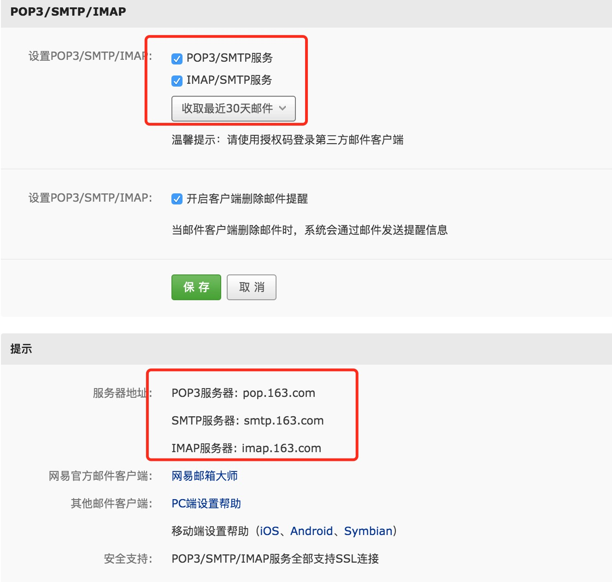
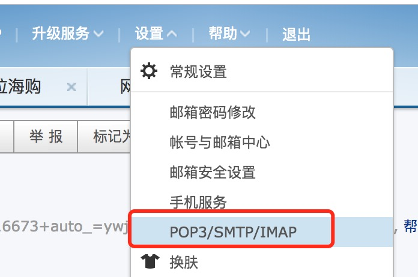

### 邮件服务

1、接入步骤

(1)到163邮箱上打开POP3/SMTP/IMAP，并生成第三方服务调用授权码

    （1）登录网易邮箱（截图以163邮箱为例）
    （2）进入“设置”>>点击“POP3/SMTP/IMAP”>>选择“POP3/SMTP服务”单选框>>然后按提示操作。
    （3）这里要求设置邮箱客户端授权码，一定要记住。
    

（2）引入mail相关的maven依赖

       <dependency>
            <groupId>javax.mail</groupId>
            <artifactId>mail</artifactId>
            <version>1.4.7</version>
       </dependency>

（3）编写代码调用网易的SMTP服务器发送邮件
    
    import org.springframework.stereotype.Service;
    
    import java.util.Properties;
    import javax.mail.*;
    import javax.mail.internet.*;
    
    /**
     * @Author: CarryJey @Date: 2018/10/20 16:18:12
     * desc：邮件发送服务
     */
    @Service
    public class MailService {
    
        public String from = "***@163.com";    //发件人邮箱地址
        public String user = "***@163.com";    //发件人称号，同邮箱地址
        public String psw = "******";     //发件人邮箱客户端授权码
    
    
        public boolean sendMail(String to,String text,String title){
            Properties props = new Properties();
            props.setProperty("mail.smtp.host", "smtp.163.com"); // 设置发送邮件的邮件服务器的属性（这里使用网易的smtp服务器）
            props.put("mail.smtp.host", "smtp.163.com"); // 需要经过授权，也就是有户名和密码的校验，这样才能通过验证（一定要有这一条）
            props.put("mail.smtp.auth", "true"); // 用刚刚设置好的props对象构建一个session
            Session session = Session.getDefaultInstance(props); // 有了这句便可以在发送邮件的过程中在console处显示过程信息，供调试使
            // 用（你可以在控制台（console)上看到发送邮件的过程）
            session.setDebug(true); // 用session为参数定义消息对象
            MimeMessage message = new MimeMessage(session); // 加载发件人地址
            try {
                message.setFrom(new InternetAddress(from));
                message.addRecipient(Message.RecipientType.TO, new InternetAddress(to)); // 加载收件人地址
                message.setSubject(title); // 加载标题
                Multipart multipart = new MimeMultipart(); // 向multipart对象中添加邮件的各个部分内容，包括文本内容和附件
                BodyPart contentPart = new MimeBodyPart(); // 设置邮件的文本内容
                contentPart.setContent(text, "text/html;charset=utf-8");
                multipart.addBodyPart(contentPart);
                message.setContent(multipart);
                message.saveChanges(); // 保存变化
                Transport transport = session.getTransport("smtp"); // 连接服务器的邮箱
                transport.connect("smtp.163.com", user, psw); // 把邮件发送出去
                transport.sendMessage(message, message.getAllRecipients());
                transport.close();
            } catch (MessagingException e) {
                e.printStackTrace();
                return false;
            }
            return true;
        }
    }
